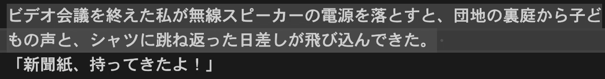

<!-- markdownlint-disable no-inline-html -->

# たんごカーソル

[VS Code](https://code.visualstudio.com)で、日本語の単語ごとにカーソルを移動できる機能拡張です。

たんごカーソルは、[Suguru Yamamoto](https://github.com/sgryjp/japanese-word-handler)氏の[Japanese Word Handler](https://github.com/sgryjp/japanese-word-handler)（[zlib License](https://github.com/sgryjp/japanese-word-handler/blob/master/LICENSE)）に、[Taku Kudo]氏の[TinySegmenter 0.1](http://chasen.org/~taku/software/TinySegmenter/)（修正BSDライセンス）を組み込んで簡易的な形態素解析を行うことで、名詞や助詞、動詞ごとにカーソルを移動させています。
お二方のプロジェクトに深く感謝いたします。

## 操作方法

機能拡張をインストールすると、OS標準の<kbd>Ctrl</kbd>（Macでは<kbd>⌥Option</kbd>キー）を併用するキーボードショートカットが設定されます。

これらのコマンドはコマンドパレットに表示されませんが、ショートカットを設定できます。
以下の表は、プラグインが提供するショートカットの一覧です。

|コマンド| 初期ショートカット| macOS, iOS, iPadOS | Emacs風 |
|------|------------|-------------------|---|
|次の単語の先頭に移動|<kbd>Ctrl</kbd>+<kbd>→</kbd>|<kbd>Option</kbd>+<kbd>→</kbd>|<kbd>Ctrl</kbd>+<kbd>Alt</kbd>+<kbd>F</kbd>|
| 前の単語の末尾に移動 |<kbd>Ctrl</kbd>+<kbd>←</kbd>|<kbd>Option</kbd>+<kbd>←</kbd>|<kbd>Ctrl</kbd>+<kbd>Alt</kbd>+<kbd>B</kbd>|
| 次の単語の先頭まで選択|<kbd>Ctrl</kbd>+<kbd>Shift</kbd>+<kbd>→</kbd>| <kbd>Option</kbd>+<kbd>Shift</kbd>+<kbd>→</kbd>|<kbd>Ctrl</kbd>+<kbd>Alt</kbd>+<kbd>Shift</kbd>+<kbd>F</kbd>|
| 前の単語の末尾まで選択| <kbd>Ctrl</kbd>+<kbd>Shift</kbd>+<kbd>←</kbd>|<kbd>Option</kbd>+<kbd>Shift</kbd>+<kbd>←</kbd>|<kbd>Ctrl</kbd>+<kbd>Alt</kbd>+<kbd>Shift</kbd>+<kbd>B</kbd>|
| 次の単語の先頭まで削除| <kbd>Ctrl</kbd>+<kbd>Delete</kbd>| <kbd>Option</kbd>+<kbd>Delete</kbd>|<kbd>Ctrl</kbd>+<kbd>Alt</kbd>+<kbd>D</kbd>|
| 前の単語の末尾まで削除| <kbd>Ctrl</kbd>+<kbd>Backspace</kbd>  | <kbd>Option</kbd>+<kbd>Backspace</kbd>|<kbd>Ctrl</kbd>+<kbd>Alt</kbd>+<kbd>H</kbd>|

## カーソル移動の変化

標準のVS Codeで、次の単語の先頭に移動するショートカット<kbd>Ctrl</kbd>+<kbd>→</kbd>を入力すると、日本語の単語区切りを認識できないために行末にカーソルが移動してしまいます。

たんごカーソルをインストールして<kbd>Ctrl</kbd>(MacやiPadでは<kbd>Option</kbd>)キーを押しながら左右のカーソルキーを<kbd>←</kbd><kbd>→</kbd>入力すると、単語ごとにカーソルを移動させることができるようになります。また、<kbd>Shift</kbd>キーを併用することで単語ごとの選択を行うこと、<kbd>Delete</kbd>や<kbd>Backspace</kbd>で単語ごとに削除することも可能です。

## 制限事項

たんごカーソルは以下の機能を取り扱うことができません

- ダブルクリックで単語を選択する
- カーソルのある位置と同じ単語をハイライトする
- 検索機能で「単語全体」を使った検索を行う

お楽しみください